# Testing and Robotic Process Automation (RPA) on a Web Application
RPA is used to mimic human tasks in the same way that a person would execute the process.
In this project I used this web application [Connected Office: Device Management System](https://connectedoffice-devicemanagement.azurewebsites.net/)
to perform User acceptance testing (UAT) using an  UiPath Robot. 

### Task performed by the robot in the orchestrator
1. Get credential stored in the orchestrator (username and password) and store them to variables

### Task perform by the robot in the Excel file
1. Get data excel file 
2. Read the data from the file, and 
3. Store the data from the file in the dataTable - three sheets (Zone, Catagory, and Device) each in its on dataTable 

### Tasks performed by the robot in the web application
1. Log In using credential stored in the orchestrator assest
2. Click on the Zone tab 
3. Peform CRUD operation on the Zones tab
4. Click on the Category tab
5. Perform CRUD operations on the Category tab
6. Click on the Device tab
7. Perform CRUD operations on the Device tab

### Purpose
To ensure that the input entered int the web application generate the expected output

### How the use the Robot
To run the application ensure that Start button is clicked on the workflow, so the application flow can start from top to bottom and 
then simply click the Run button

### Table of Contents
1. [Login](#Login)
2. [Excel](#Excel)
3. [Zone](#Zone)
4. [Category](#Category)
5. [Device](#Device)
6. [Delete](#Delete)

      
#### 1. Login  
* The Robot will get the credential from the orchestrator and use them to log in  
WebImage | UiPathImage 
:--------------------|--------------------:
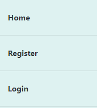 | 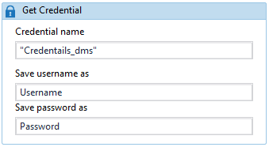

      
#### 2. Excel  
*Add the file to read data from  
UiPathImage |
:--------------------|
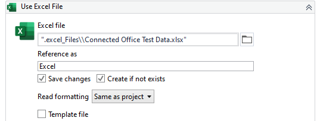 |

* Reading zone data into a dataTable  
UiPathImage |
:--------------------|
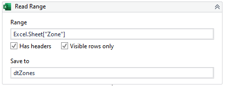 |

* Reading category data into a dataTable  
UiPathImage |
:--------------------|
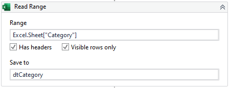 |

* Reading device data into a dataTable  
UiPathImage |
:--------------------|
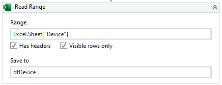 |

      
#### 3. Zones  
After logging In the Robot will:
* Click on the zone tab  
WebImage | UiPathImage 
:--------------------|--------------------:
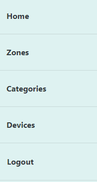 

* Click the the add icon and add the data from the Zone dataTable ZoneName and Zonedescription column  and click Create button  
WebImage | UiPathImage 
:--------------------|--------------------:
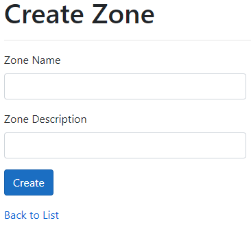 | 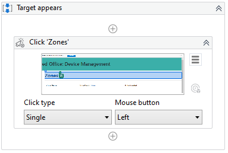

* Click the view icon to view the zone added  
WebImage | UiPathImage 
:--------------------|--------------------:
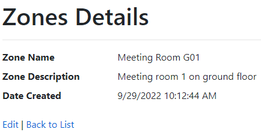 | 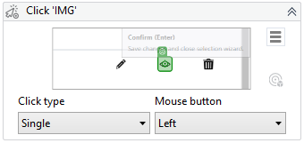

* Click the the edit button to test edti Zone description and click Save button  
WebImage | UiPathImage 
:--------------------|--------------------:
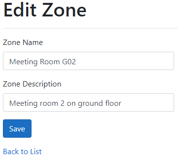 | 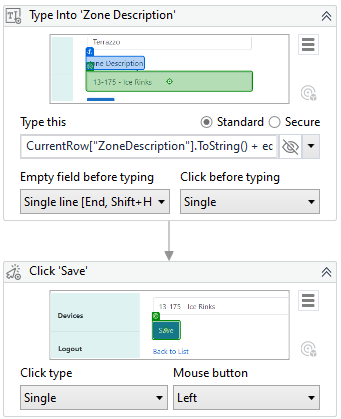

      
#### 4. Category  
Then after all the rows in the zone dataTable have been added the Category tab will be clicked and the Robot will:
* Click the the add icon and add the data from the Category dataTable CategoryName and Categorydescription column and click Create button  
WebImage | UiPathImage 
:--------------------|--------------------:
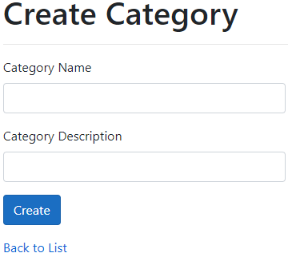 | 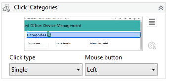

* Click the view icon to view the category added  
WebImage | UiPathImage 
:--------------------|--------------------:
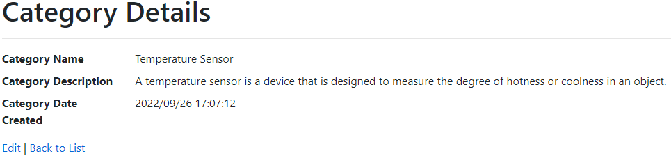 | 

* Click the the edit button to test edti category description and click Save button  
WebImage | UiPathImage 
:--------------------|--------------------:
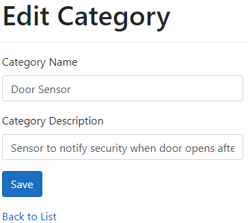 | 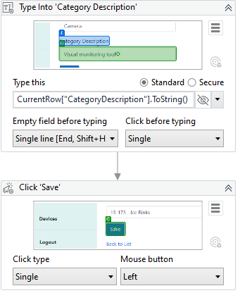

      
#### 5. Device  
Then after all the rows in the category dataTable have been added the Device tab will be clicked and the Robot will:
* Click the the add icon and add the data from the Device dataTable and click Create button  
WebImage | UiPathImage 
:--------------------|--------------------:
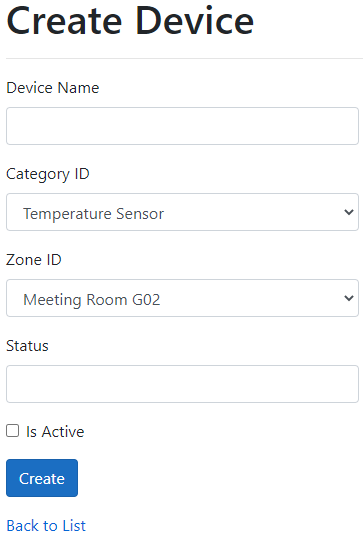 | 

* Click the view icon to view the device added  
WebImage | UiPathImage 
:--------------------|--------------------:
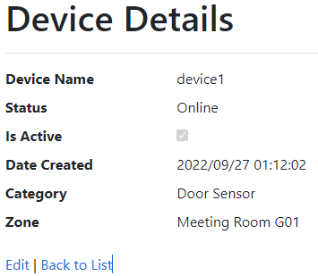 | 

* Click the the edit button to test edti device status and check/uncheck the box for isActive and click Save button  
  * For the device status a String array was used to store {"In Operation", "Broken", "Maintenance", "Stopped"}, so to test the device status
  an element in the array is returned randomly to the status textbox. And for the isActive the box is checked/unchecked.  
WebImage | UiPathImage 
:--------------------|--------------------:
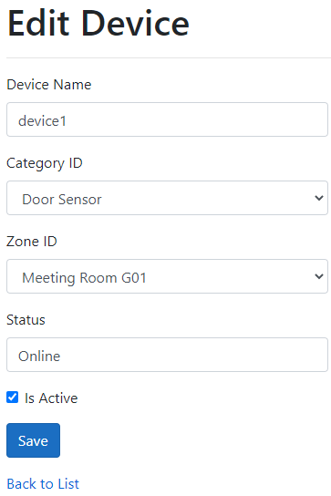 | 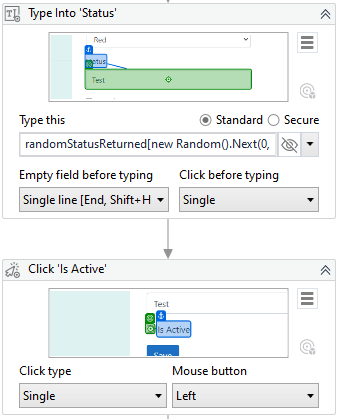

      
#### 6. Delete  
Then after all the rows in the device dataTable have been added the Robot will:

* Delete all the devices  
* Then, Click the Zone tab and delete all the zones  
* Finally, Click the Category tab and delete all the categories  

